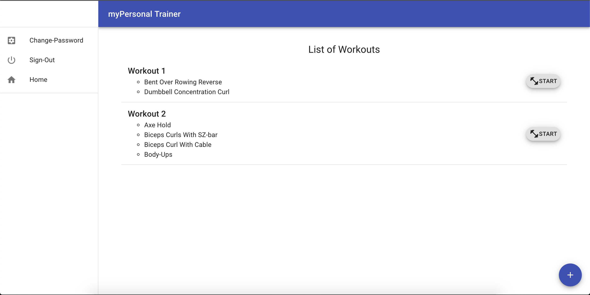

# myPersonal Trainer

This is the remake of another [application](https://github.com/kevinrosario/myPersonal-Trainer-Client) that I already created. The main motivation to make this app was to use redux to manage state in a different way. This app is designed to allow users create workouts and edit them adding or removing exercises. Users can create and edit workouts only by logging in with a name, email, password, height and weight.

##### Screenshot

### User Stories
- As a unregistered user, I would like to sign up with email and password.
- As a registered user, I would like to sign in with email and password.
- As a signed in user, I would like to change password.
- As a signed in user, I would like to sign out.
- As a unregistered user, I would like to create a new workout.
- As a unregistered user, I would like to edit exercises added to the workout.
- As a signed in user, I would to add or remove exercises from a workout.
- As a signed in user, I would to remove created workouts.

### Technologies Used
- JavaScript
- React.js
- Redux
- JSX
- MongoDB & Mongoose
- Node.js
- Express.js
- Handlebars
- Axios

### The Process

I made this project in only three days and around 30 hours. I recycled components from the old application and adapted them to work with redux. The app follows the same flow as the original one but with some differences in UI. This has been the greatest challenge I have had till this day bucause managing state with Redux is a bit more complicated than doing it with the components.

##### Stretch Goals:
1. Adding a 'Discover Workouts' route to show workouts created by other people.
2. Adding images and/or avatars.
3. Adding likes to other people workouts.
4. Adding the ability to clone another person workout.

##### Future Iterations
I want to add a timer that will help me rest between sets of every exercise in the workout.
I also want to add a feature that allows user to save their past workouts and compare the progess made.

#### Set-up
1. Download this template.
2. Unzip and rename the template directory
3. Move into the new project and git init.
4. Empty README.md and fill with your own content.
5. Replace myPersonal-Trainer-Client in package.json with your projects name.
6. Replace the "homepage" field in package.json with your (public) Github account name and repository name.
7. Install dependencies with npm install.
git add and git commit your changes.
8. Run the development server with npm start.

##### Sites and Images:

[Front-End Repository](https://github.com/kevinrosario/myPersonal-Trainer-Client)

[Front-end app](https://kevinrosario.github.io/myPersonal-Trainer-Client/)

[Back-End Repository](https://github.com/kevinrosario/myPersonal-Trainer-API)

[Back-end app](https://mypersonal-trainer.herokuapp.com/)

[Wireframe](https://imgur.com/p2kaWSt)
